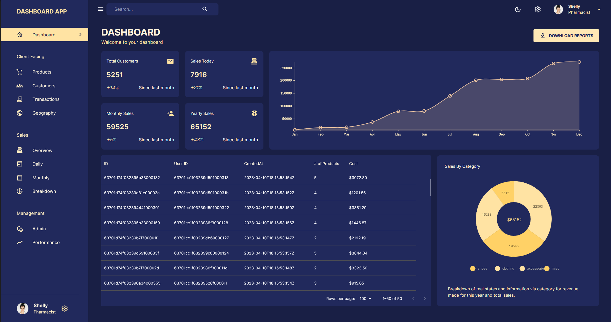

<br />
<div align="center">
  <h1 style="margin-bottom: 50px">Dashboard App </h1>

[](http://forthebadge.com)
[](http://forthebadge.com)


 
</div>

# 🚩 Table of Contents

- [About The Project](#about-the-project)
- [Live Demo](#live-demo)
- [Built With
  ](#built-with
  )
- [Getting Started
  ](#getting-started)
- [Mobile support](#mobile-support)
- [Roadmap](#roadmap)
- [Contact](#contact)

## 🚀 Live Demo
   Backend: https://dashboard-app-backend-l19t.onrender.com </br>
  Frontend: https://dashboard-app-frontend.onrender.com
  
## 💬 About The Project

My Notes App is my first big project and important for me. In the project I used the acquired knowledge and put it together in this project.

Using My Notes App, we can easily add and quickly edit/delete our notes.

We set up our own account so that our notes are always available to us.

The application has validation and authorization of user registration/login.

The application is fully responsive so we can use it on a phone or laptop.
  
## 📦 Built With

<p align="center">
  <a href="https://skillicons.dev">
    
  </a>
</p>

##  🌏 Getting Started

To run this project, install it locally using npm.

### Prerequisites

Install the latest version of npm in your runtime.
* npm
  ```sh
  npm install npm@latest -g
  ```
  
 ### 🔧 Installation


1. Clone the repo
   ```sh
   git clone https://github.com/krystian2077/dashboard-app-frontend
   ```
3. Install NPM packages
   ```sh
   npm install
   ```
4. Run npm script
   ```sh
   npm start
   ```
## Mobile Support

## 🐾 Roadmap

- [x] Add responsive view
- [x] Add dark/light mode
- Add authentication
- Add download reports


<!-- CONTACT -->
## 📞 Contact

Email: krystian.potaczek07@gmail.com

My phone number: 788-986-074


